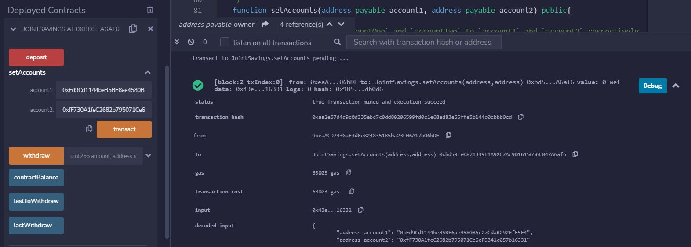
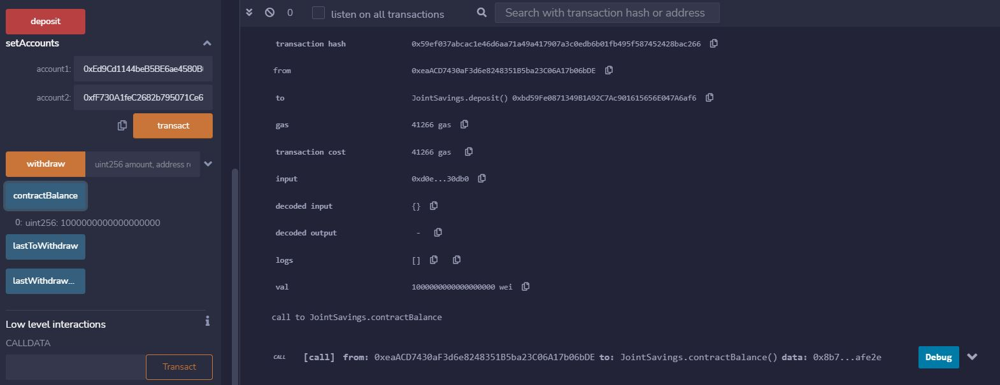

# Solidity Contract: Joint Savings Account

This contract is to create a joint savings account between two addresses. 

It has the function setAccounts(address payable account1, address payable account2) that allows the user set the two valid addresses to make withdrawals. 
 
 
 
 

 

Through the Remix IDE the user can set the two addresses that can make withdrawals from the contract. 
  
  
  

 

First transaction depositing 1 ether to the contract.
 
 
 

 

Final balance of the contract after depositing 16 ether.
 
 
 

 

Withdrawing: 5 ether to valid account 1; 10 ether to valid account 2.
You can see through the function lastToWithdraw and lastWithdrawAmount that the last transaction was 10 ether deposited to the highlighted account. 

